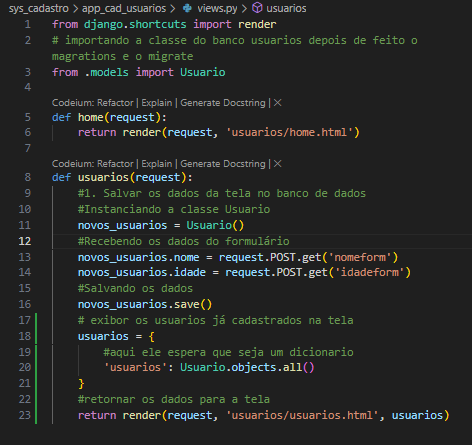

# Cadastro web
Sistema ``web`` de cadastro de usuários, com Framework [Django](https://docs.djangoproject.com/en/5.0/) e integração com Banco de dados.

---

## Versão v1.0

&nbsp;

> ### Pré-requisitos

Python 3.9+
 
&nbsp;
  
> ### Bibliotecas
 
[Django](https://docs.djangoproject.com/en/5.0/)
[Bootstrap](https://getbootstrap.com/docs/5.0/getting-started/introduction/)
[SQLite](https://www.sqlite.org/docs.html)

&nbsp;

> ### Funcionalidades:

* Cadastrar novos usuários com nome, idade.
* Listar todos os usuários cadastrados em uma tabela
* Salvar os dados em um banco [SQLite](https://www.sqlite.org/docs.html)
&nbsp; 

> ### Pré-code
> > virtual environment
#### Feito via terminal, instalação de um ambiente virtual
    python -m venv env
    .\env\Scripts\activate

> > #### Instalando as bibliotécas

    python -m pip install --upgrade pip
    pip install django 

&nbsp;
> ### Code
> > #### Criação do projeto
 
    django-admin startproject sys_cadastro
Nessa etapa foi criada a pasta do projeto e o arquivo que gerencia todo o porjeto `manege.py`, atravéz desse arquivo que o projeto ira rodar pela primeira vez para fins de teste.

>> #### Entra na pasta do projeto.

    cd /sys_cadastro
&nbsp;
>> #### Criação dos App's

    python manage.py startapp app_cad_usuarios
* obs>> navege até ``./app_cad_usuarios/settings.py``
em `INSTALLED_APPS` e adicione o `app_cad_usuarios`

>> #### Entra na pasta do app.

    cd /sys_cadastro/app_cad_usuarios
&nbsp;

>>> ##### Sequencia de criação

1. criar a rota, `O link` (urls.py)
2. criar o que fazer quando chegar naquele link (views.py)
3. criar o exibir quando chegar no link (html e css)

&nbsp;

   1. Em ``./sys_cadastro/sys_cadastro/urls.py`` vamos criar a rota para a pagina inicial

&nbsp;
    
   2. Em ``./sys_cadastro/app_cad_usuarios/views.py``  vamos criar a função ``home``

&nbsp;

   3. Em ``./sys_cadastro/app_cad_usuarios/templates/usuarios`` vamos criar o arquivo ``home.html``

&nbsp;

>> #### Visulizar projeto e estilização
    python manage.py runserver

Nas documentações do [Bootstrap](https://getbootstrap.com/docs/5.0/getting-started/introduction/) vamos buscar uma [Navbar](https://getbootstrap.com/docs/5.0/components/navbar/) para compor nossa ``home`` e buscar um formulário de imput, etc...
* Dentro do ``form`` em ``./sys_cadastro/app_cad_usuarios/templates/usuarios/home.html`` passar o ``csrf_token``
&nbsp;
    
&nbsp;

Agora começa a etapa de criação das views de cadastro ligando o banco de dados com as informações do formulario

&nbsp;

&nbsp;

Fazendo o migrations e o migrate, são **obrigatórios** ao se trabalhar com o ``banco de dados``

    python manage.py makemigrations
    python manage.py migrate

Criando a view que recebe os dados do formulário

Construção da página ``usuarios.html``

>>> ######No terminal
    python manage.py makemigrations
    python manage.py migrate 

>>>######teste web
    python manage.py runserver

E faremos um template base pra não precisar reescrever todas as informaçoes e componetes do bootstrap em ``./sys_cadastro/app_cad_usuarios/templates/usuarios/base.html``
&nbsp;

**Fizemos a estilização da página de usuarios**

&nbsp;

> ### Uso
* Em terminal
  
        python manage.py runserver

* Depois em navegador
  
        http://127.0.0.1:8000

&nbsp;

> ### Implementação

 [Django](https://docs.djangoproject.com/en/5.0/) em uso para codificação.
&nbsp;

> Créditos

Código inicial baseado no canal [Dev Aprender](https://www.youtube.com/watch?v=-m5ywU8SW9E&list=WL&index=4).

Documentação e melhorias adicionadas por [Wesley Pereira](https://github.com/wesleyp846)

&nbsp;
> Licença
MIT

Espero que a documentação os ajude a entender a aplicação! 
Por favor, sinta-se a vontade para melhorá-la.